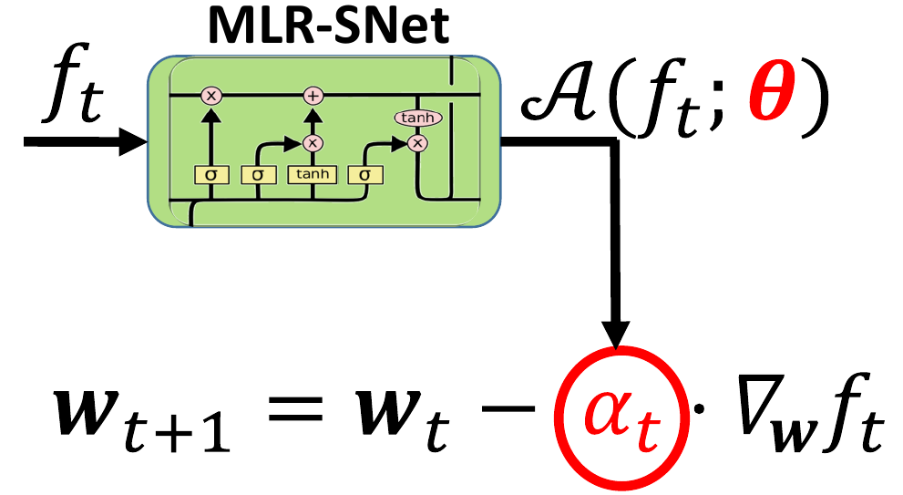

# MLR-SNet: Transferable LR Schedules for Heterogeneous Tasks

This is an official PyTorch implementation of [MLR-SNet: Transferable LR Schedules for Heterogeneous Tasks](https://arxiv.org/abs/2007.14546).

```
@journal{shu2021mlrsnet,
    title     = {MLR-SNet: Transferable LR Schedules for Heterogeneous Tasks},
    author    = {Shu, Jun and Zhu, Yanwen and Zhao, Qian and Meng, Deyu and Xu, Zongben},
    year      = {2021}
} 
```

## Overview



The learning rate (LR) is one of the most important hyperparameters in stochastic gradient descent (SGD) algorithm for training deep neural networks (DNN). However, current hand-designed LR schedules need to manually pre-specify a fixed form, which limits their ability to adapt to practical non-convex optimization problems due to the significant diversification of training dynamics. Meanwhile, it always needs to search proper LR schedules from scratch for new tasks, which, however, are often largely different with task variations, like data modalities, network architectures, or training data capacities. To address this learning-rate-schedule setting issues, we propose to parameterize LR schedules with an explicit mapping formulation, called \textit{MLR-SNet}. The learnable parameterized structure brings more flexibility for MLR-SNet to learn a proper LR schedule to comply with the training dynamics of DNN. Image and text classification benchmark experiments substantiate the capability of our method for achieving proper LR schedules. Moreover, the explicit parameterized structure makes the meta-learned LR schedules capable of being transferable and plug-and-play, which can be easily generalized to new heterogeneous tasks. We transfer our meta-learned MLR-SNet to query tasks like different training epochs, network architectures, data modalities, dataset sizes from the training ones, and achieve comparable or even better performance compared with hand-designed LR schedules specifically designed for the query tasks. The robustness of MLR-SNet is also substantiated when the training data are biased with corrupted noise. We further prove the convergence of the SGD algorithm equipped with LR schedule produced by our MLR-Net, with the convergence rate comparable to the best-known ones of the algorithm for solving the problem.
